# GTA IV Grass & Procedural Props Fix

Fix disappearing grass and procedural props with automatic pool sizing, configurable density, and distance scaling.

**By [iammrmikeman](https://www.nexusmods.com/gta4/users/19482074)** · **Version 1.2** · **GTA IV / Vice City Nextgen Edition**

[Download on Nexus Mods](https://www.nexusmods.com/gta4/mods/1230?tab=files) · [Installation](#installation) · [Compile it yourself](#compile-it-yourself) · [Screenshots](#screenshots) · [Support](#support-and-credits)

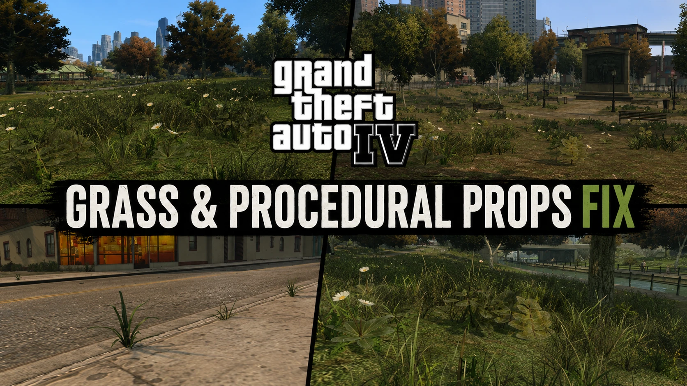

GTA IV normally limits how many procedural objects can exist at the same time. When those limits are reached, grass and other ground details can stop appearing, leaving large or inconsistent empty patches. This mod expands the relevant limits and provides controls for density and distance.

## Features

- Increased capacity for grass and vegetation.
- Increased capacity for litter, rubbish, and other procedural ground props.
- More consistent vegetation coverage while travelling through Liberty City.
- Separate density controls for plants and procedural objects.
- Configurable procedural-object generation and visibility distance.
- Automatic pool sizing based on the selected settings.
- Individual filtering for grass, vegetation, clutter/litter, and other procedural-object classes.

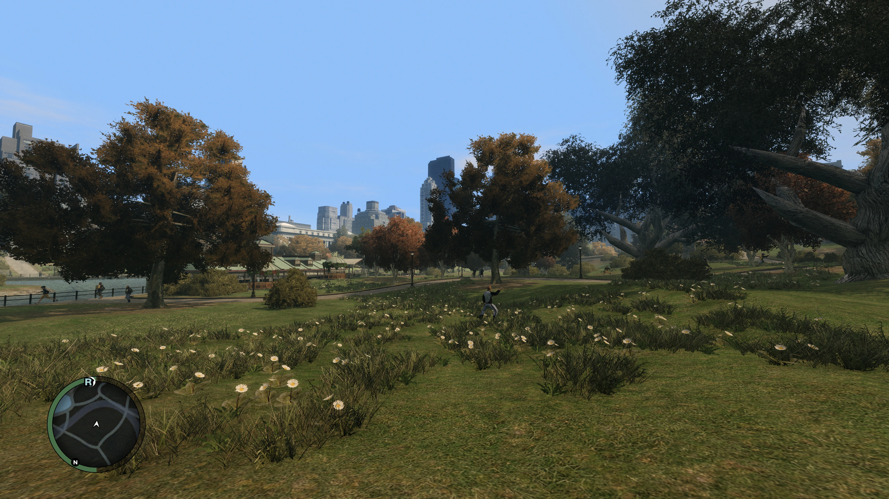

## Requirements

- A GTA IV or Vice City Nextgen Edition executable covered by the mod. See [Compatibility](#compatibility).
- FusionFix or another ASI loader configured for your game installation.

### Recommended mods shown in the screenshots

The Nexus page recommends these companion mods:

| Mod | Download |
| --- | --- |
| Console Vegetation | [Console Visuals releases](https://github.com/Tomasak/Console-Visuals/releases/) |
| Restored Vegetation | [Nexus Mods](https://www.nexusmods.com/gta4/mods/806?tab=files) |
| Solitude 3 | [Nexus Mods](https://www.nexusmods.com/gta4/mods/417) |

The screenshots include other visual mods, so their complete appearance depends on the installed mod setup.

## Installation

1. Close GTA IV and install FusionFix or your preferred ASI loader.
2. Download the mod from the [Nexus Files page](https://www.nexusmods.com/gta4/mods/1230?tab=files) and extract the archive.
3. If updating, back up the existing ASI and its matching INI.
4. Copy these two files into the ASI plugin folder used by your loader:

   ```text
   GTAIV.EFLC.ProceduralFixes.asi
   GTAIV.EFLC.ProceduralFixes.ini
   ```

5. Keep both files together and keep only one installed copy of this ASI. Start with the INI supplied with that release.
6. Set the in-game **Detail Distance** to **100**, as recommended on the Nexus page, then restart the game after changing the mod's settings.

For a loader configured to use `plugins`, the layout is:

```text
GTA IV/
├── GTAIV.exe
└── plugins/
    ├── GTAIV.EFLC.ProceduralFixes.asi
    └── GTAIV.EFLC.ProceduralFixes.ini
```

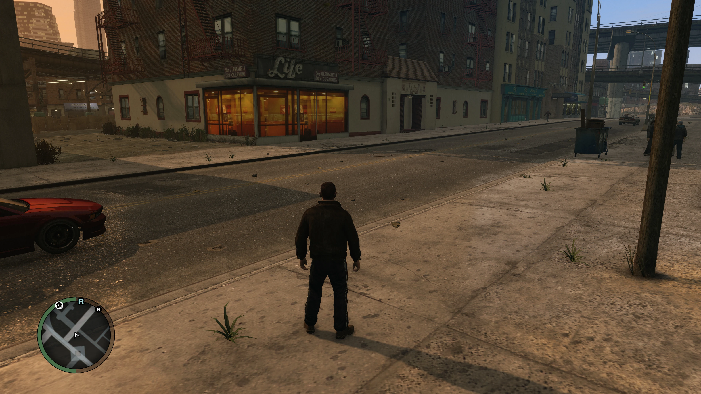

## Recommended settings

The Nexus description labels the following preset **Recommended Version 1.1 Settings**. Its values are preserved here:

```ini
[ProceduralPool]
Capacity=auto
RenderedObjectCapacity=auto
ProviderCapacity=auto
DistanceMultiplier=1.0
PlantDensityMultiplier=1.0
ProceduralObjectDensityMultiplier=1.0
DensityClassMask=3
DebugLog=1
HangWatchdog=1
HangTimeoutSeconds=45
HangMessageBox=1
```

**Recommended in-game setting:** Detail Distance **100**.

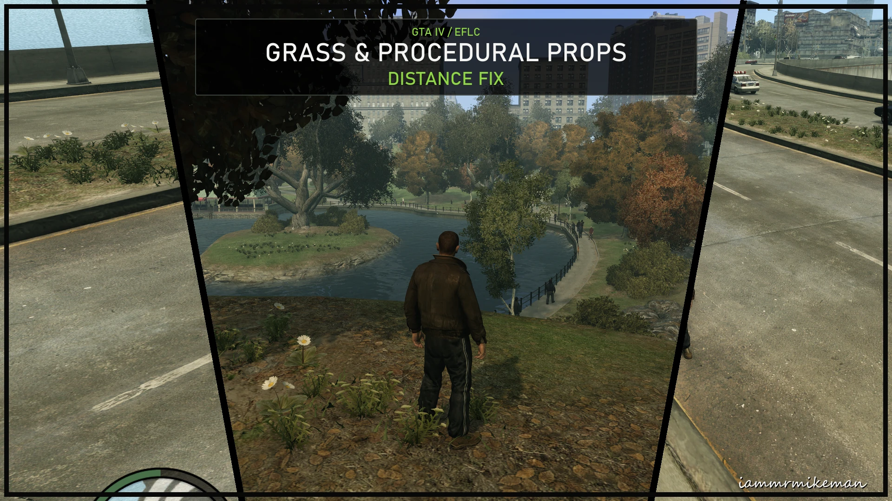

## Compatibility

The [Nexus mod page](https://www.nexusmods.com/gta4/mods/1230) lists these game versions:

| Game | Listed versions |
| --- | --- |
| Grand Theft Auto IV | 1.0.4.0, 1.0.7.0, 1.0.8.0 |
| Grand Theft Auto IV: Complete Edition | 1.2.0.43, 1.2.0.59 |
| GTA IV: Vice City Nextgen Edition | VCNGE |

Executable recognition depends on the exact executable, not just its displayed version number. The v1.2 source release disables the fix for unrecognized executable hashes without applying its patches.

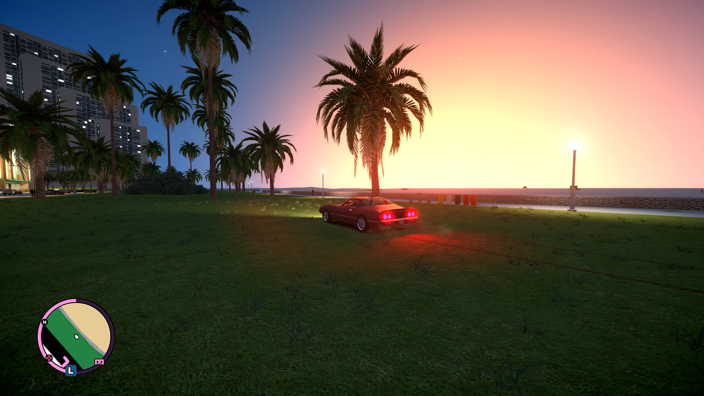

## Troubleshooting

If you experience any of the following, return to the recommended settings for your release and fully restart GTA IV:

- Missing or flickering models.
- Broken LOD transitions.
- Objects disappearing.
- Freezes or crashes.
- Unusually heavy streaming behaviour.

When reporting an issue, include:

- Your complete `GTAIV.EFLC.ProceduralFixes.log`.
- The GTA IV version and mod version you are using.
- Your INI settings, ASI loader, and other installed mods.
- The location and steps that lead to the problem.

Report issues through [Nexus Posts](https://www.nexusmods.com/gta4/mods/1230?tab=posts) or the [iammrmikeman Mods Discord server](https://discord.gg/4pWnszrvMP).

To roll back, close the game and restore the backed-up ASI and matching INI together. Removing the ASI disables the fix on the next launch.

## Compile it yourself

These instructions build the **v1.2 C source** into a **32-bit Windows ASI**. They were checked against the packaged `GRASS-BLD-0050` source.

### 1. Get the tools and source

- **Windows**, with PowerShell.
- **TinyCC 0.9.27 for Win32/i386**: get `tcc-0.9.27-win32-bin.zip` from the [TinyCC release archive](https://download.savannah.gnu.org/releases/tinycc/), linked by the [TinyCC project](https://bellard.org/tcc/). Extract the complete compiler folder, including `include` and `lib`, for example to `C:\Tools\tcc`.
- **[Python 3.10 or newer for Windows](https://www.python.org/downloads/windows/)**, available through `py -3` or `python`. No additional Python packages are needed for the included helper.
- The complete mod source from this repository or the [source-included Nexus download](https://www.nexusmods.com/gta4/mods/1230?tab=files), together with its matching `GTAIV.EFLC.ProceduralFixes.ini`.

Keep all files in `src`, including the generated `.h` and `.inc` files. The compiler command uses the release's explicit list of ten C modules.

Open PowerShell in the folder containing this layout:

```text
project/
├── README.md
├── GTAIV.EFLC.ProceduralFixes.ini
├── src/
│   ├── GTAIVProceduralPool.c
│   ├── self_contained_ucl.c
│   ├── universal_behavior.c
│   ├── ... remaining C files and headers ...
│   └── ... generated headers and include files ...
└── tools/
    └── harden_pe.py
```

The [included `harden_pe.py`](tools/harden_pe.py) is the helper used by the v1.2 release build. Keep it alongside the source when adding this README to a repository.

### 2. Compile the ASI

Adjust the first line to the location of your extracted compiler, then run:

```powershell
$tcc = 'C:\Tools\tcc\tcc.exe'

& $tcc -v
# Expected: tcc version 0.9.27 (i386 Windows)

$sources = @(
    'src\GTAIVProceduralPool.c'
    'src\universal_behavior.c'
    'src\universal_behavior_hooks.c'
    'src\universal_hooks.c'
    'src\universal_install.c'
    'src\universal_pipeline.c'
    'src\universal_plant_bank.c'
    'src\universal_profiles.c'
    'src\universal_source_bank.c'
    'src\self_contained_ucl.c'
)

New-Item -ItemType Directory -Path build -Force | Out-Null

& $tcc -m32 -Wall -Werror -shared -I src @sources -lkernel32 -luser32 -lmsvcrt -o build\raw.asi
if ($LASTEXITCODE -ne 0) { throw 'Compilation failed.' }
```

Use the **i386 Windows** compiler even on a 64-bit Windows installation. The mod runs inside GTA IV's 32-bit process.

### 3. Process the compiled binary

Run the release helper to enable the PE's ASLR and DEP compatibility flags, normalize the linker timestamp, and calculate and verify its checksum:

```powershell
py -3 tools\harden_pe.py build\raw.asi build\GTAIV.EFLC.ProceduralFixes.asi --report build\HARDENING.json
if ($LASTEXITCODE -ne 0) { throw 'ASI processing failed.' }

Copy-Item -LiteralPath GTAIV.EFLC.ProceduralFixes.ini -Destination build\GTAIV.EFLC.ProceduralFixes.ini

Get-FileHash -Algorithm SHA256 build\GTAIV.EFLC.ProceduralFixes.asi
```

If your installation uses `python` instead of the Windows launcher, replace `py -3` with `python`.

The installable files are now:

```text
build/GTAIV.EFLC.ProceduralFixes.asi
build/GTAIV.EFLC.ProceduralFixes.ini
```

Install this pair using the [installation steps](#installation). Keep `raw.asi` as an intermediate build file; install the final `GTAIV.EFLC.ProceduralFixes.asi`.

### Build verification

On 6 September 2026, this compiler command and helper reproduced the local packaged **v1.2 / GRASS-BLD-0050** ASI byte for byte from its 28 packaged source files:

```text
Size:    577536 bytes
SHA-256: 6C032A33C3922EEBAD93E9473AA7143DFEF480F16E70A727A7BEB5DB21529BDF
```

That comparison applies to the unmodified v1.2 source and the checked TinyCC toolchain. Changes to the source, toolchain, module order, or intermediate output name can change the hash. Keep the intermediate filename `raw.asi` when reproducing this build. A successful compilation confirms the build; in-game behaviour still needs testing.

### Common build problems

| Problem | What to check |
| --- | --- |
| `tcc.exe` is not found | Update `$tcc` to the actual path of the extracted compiler. |
| Missing standard or Windows headers/libraries | Extract the entire Win32 TinyCC archive, including its `include` and `lib` folders. |
| Missing generated `.h` or `.inc` file | Restore the complete `src` directory from the same release. |
| Architecture or inline-assembly errors | Confirm that `tcc -v` reports `i386 Windows`. |
| Duplicate symbols | Use the ten-module command above without adding every other C file in `src`. |
| `py` is not recognized | Use `python` if available, or install Python for Windows. |

## Screenshots

All 17 gallery images and the Nexus page banner are included. The featured images above and the additional images below come from the [original Nexus gallery](https://www.nexusmods.com/gta4/mods/1230?tab=images).

### More images by iammrmikeman

<details>
<summary>View six additional author screenshots</summary>

| Park path | Vegetation coverage |
| --- | --- |
| 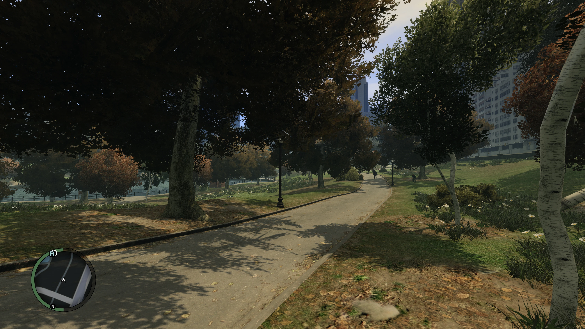 | 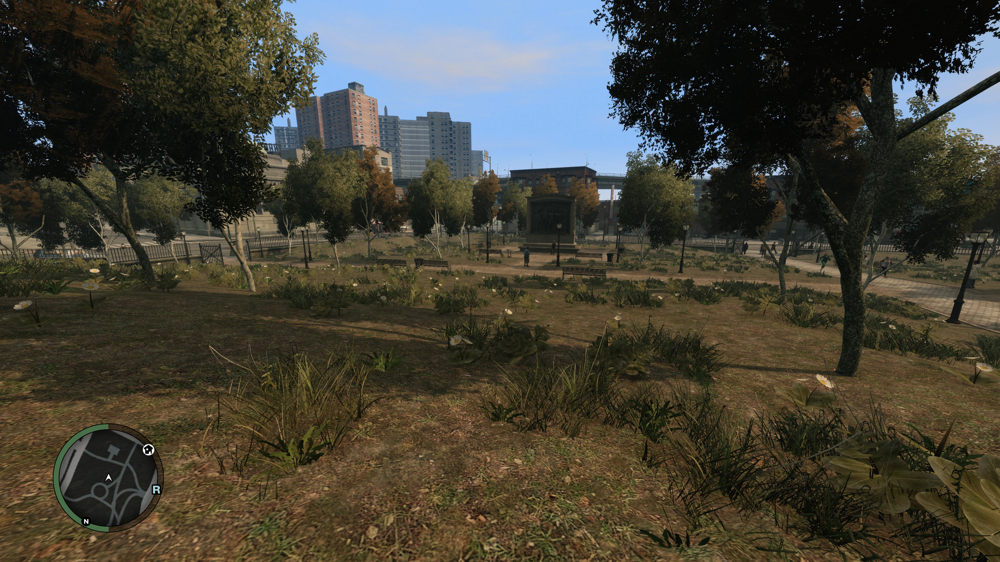 |

| Grass and procedural vegetation | Grass and flowers |
| --- | --- |
| 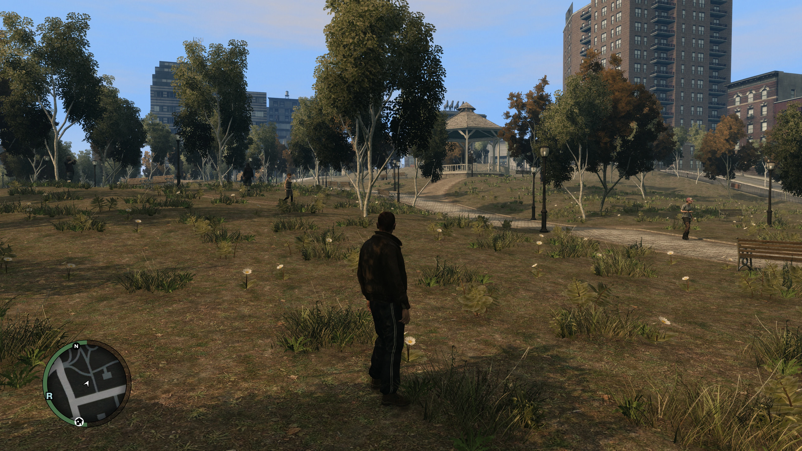 | 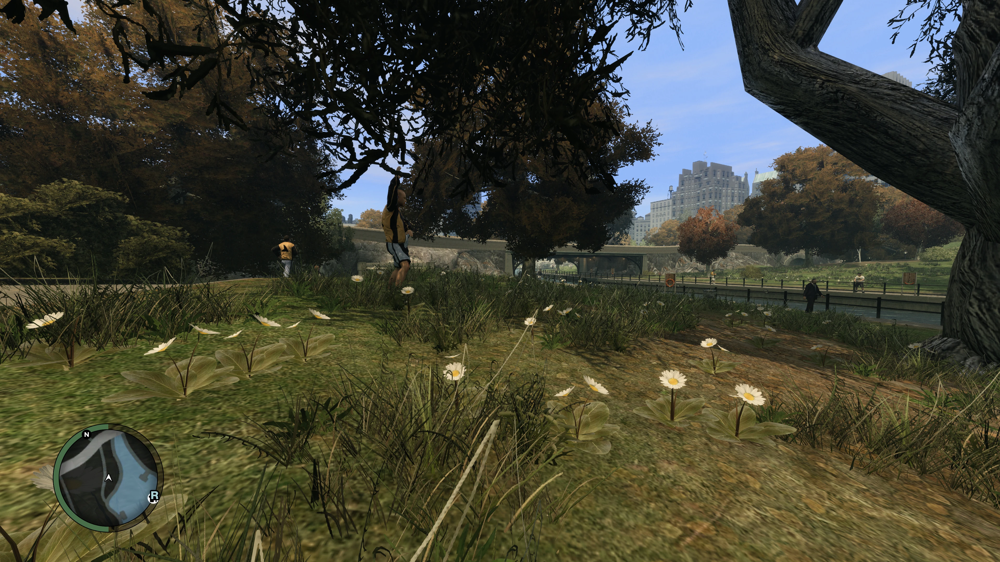 |

| Vice City during the day | Vice City at night |
| --- | --- |
| 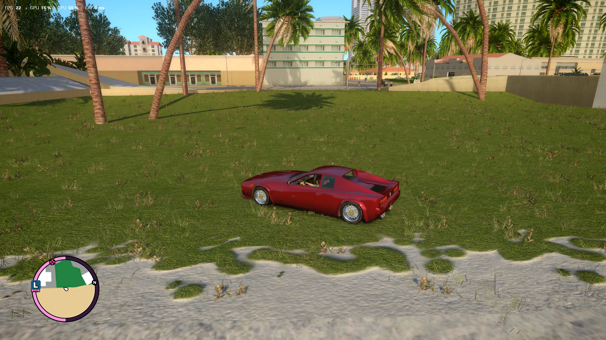 | 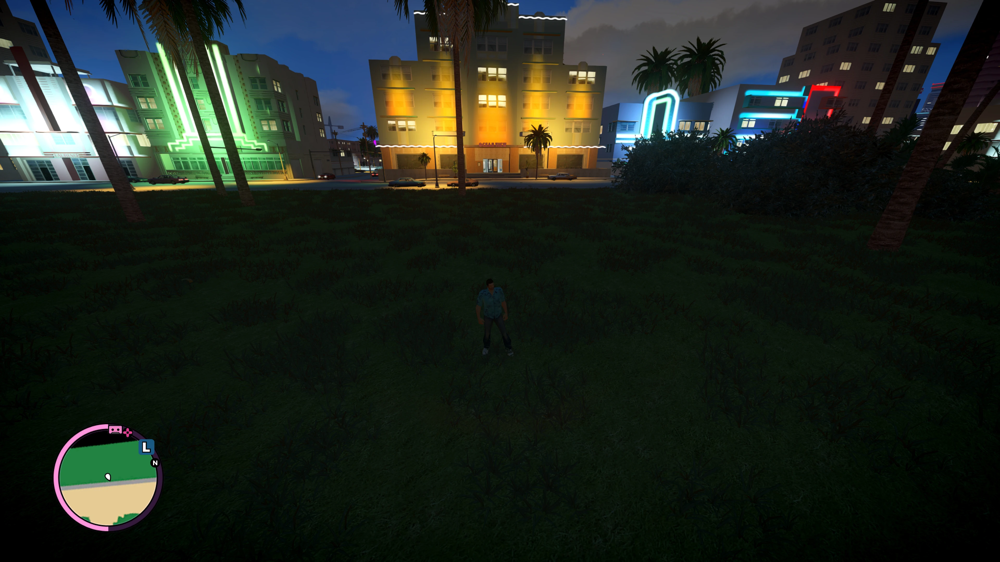 |

</details>

### Community images

<details>
<summary>View six community screenshots by JKCsaba and T1ru</summary>

**JKCsaba**

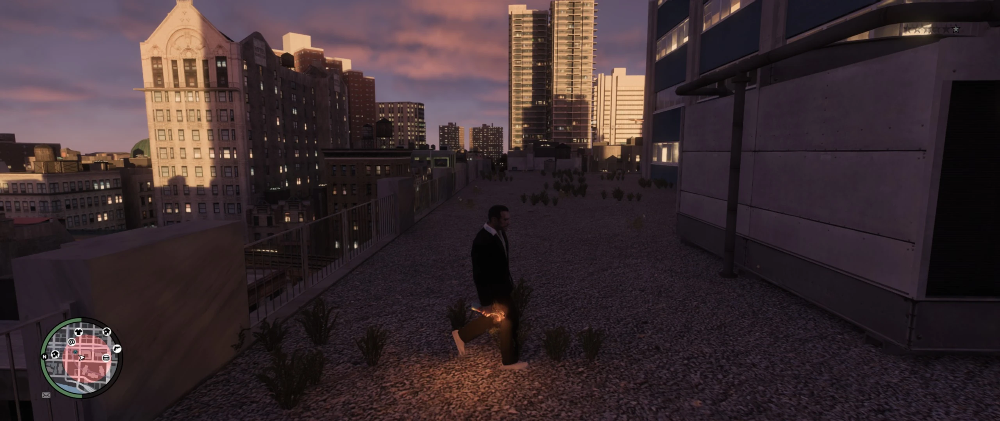

**T1ru**

| Grass beside buildings | Vegetation beneath a bridge |
| --- | --- |
| 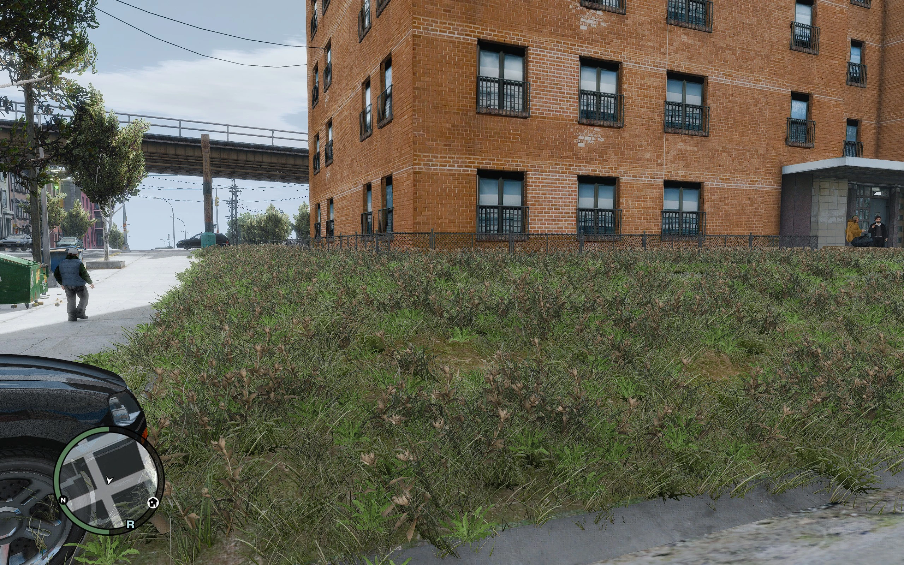 | 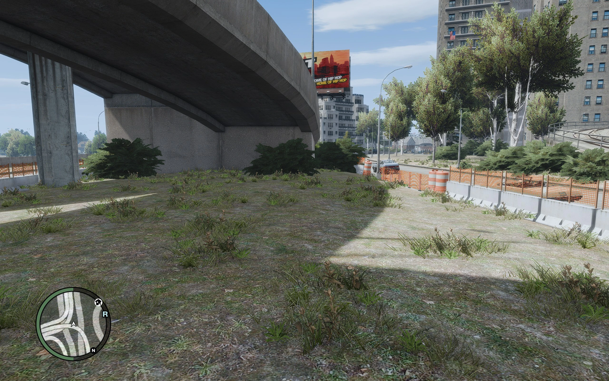 |

| Park vegetation | Roadside grass |
| --- | --- |
| 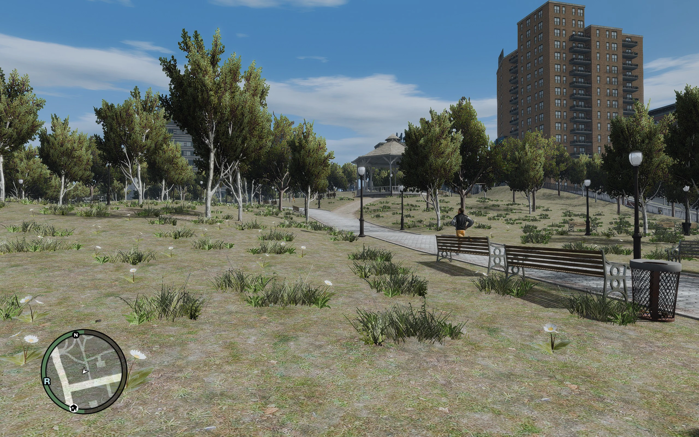 | 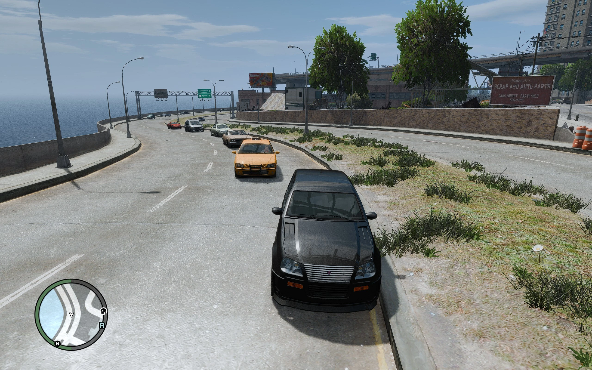 |

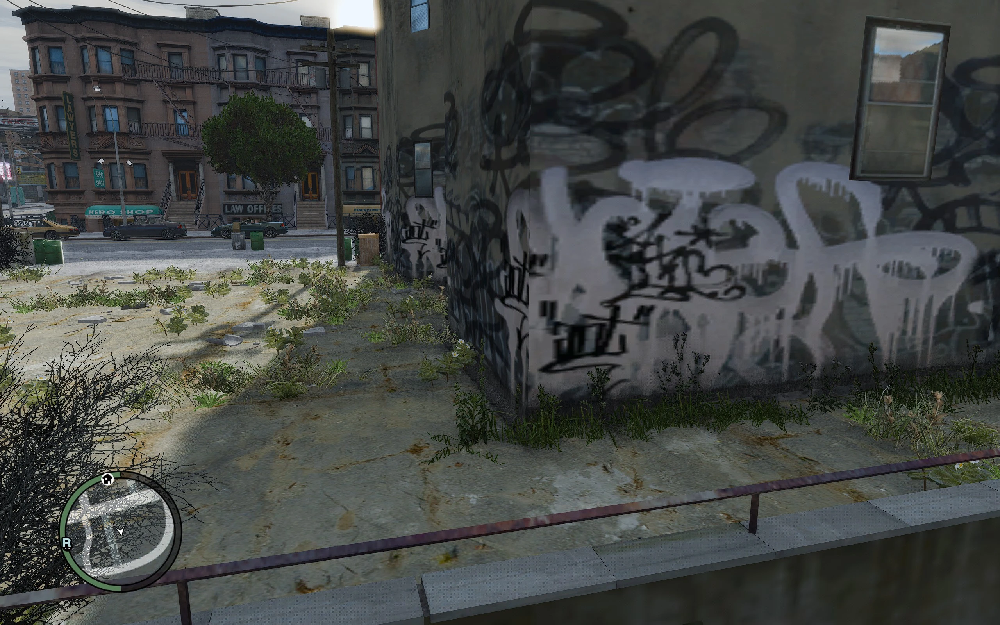

</details>

[Image credits and original Nexus image links](assets/IMAGE_SOURCES.md).

## Version history

<details>
<summary>View release highlights</summary>

### 1.2

- Adds another independently identified VCNGE executable variant.
- Updates density scaling so the new `1.0` baseline represents the previous `0.5` setting.
- Adds bounded initialization coordination for compatible ASI loaders.
- Defers optional diagnostic initialization until after patch installation.
- Uses strict executable-hash selection and disables the fix for unknown hashes.

These v1.2 notes come from the packaged release changelog.

### 1.1

- Added VCNGE compatibility.
- Introduced an optional guarded profile check for unrecognized executables. Version 1.2 replaces that behaviour with strict hash-based refusal.

### 1.0

- Added coordinated distance scaling for generation, source queries, residency, and rendering.
- Introduced automatic capacity sizing, separate plant/object density settings, and class filtering.
- Expanded procedural storage and added executable identification, validation, rollback, and diagnostics.
- Made the source available to the community.

### 0.9.8

- Expanded recognition of 1.0.8.0 executables and Gillian's Modpack.

### 0.9.7

- Introduced 1.0.8.0 compatibility, corrected recognition of another 1.2.0.59 variant, and added an option to disable debug logging.

</details>

## Open source

The mod's source has been available since version 1.0 so the community can inspect its implementation and future development. See [Compile it yourself](#compile-it-yourself) to build the included source.

For reuse and distribution terms, refer to **Permissions and credits** on the [Nexus mod page](https://www.nexusmods.com/gta4/mods/1230).

## Support and credits

**My mods will always be free.**

- **YouTube:** [@Iammrmikeman](https://www.youtube.com/@Iammrmikeman) - please support the channel.
- **Email:** [iammrmikeman25@gmail.com](mailto:iammrmikeman25@gmail.com).
- **Discord:** [iammrmikeman Mods](https://discord.gg/4pWnszrvMP).
- **Nexus:** [iammrmikeman](https://www.nexusmods.com/gta4/users/19482074).

Be patient - I might be buried in a debug log.

A big thank you to **TJDM**, whose video **"GTA IV Has a Grass Problem"** inspired this mod.

Screenshots and artwork are credited to **iammrmikeman**, **JKCsaba**, and **T1ru** as identified in the Nexus gallery.

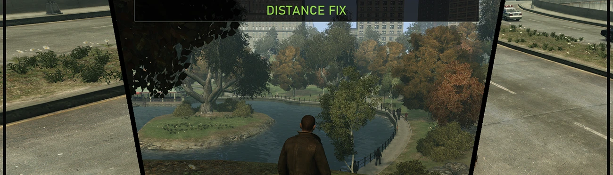

---

Adapted from the [Nexus description](https://www.nexusmods.com/gta4/mods/1230) and [image gallery](https://www.nexusmods.com/gta4/mods/1230?tab=images), checked on 6 September 2026. The v1.2 settings note and build instructions were checked against the corresponding local release source and documentation.
